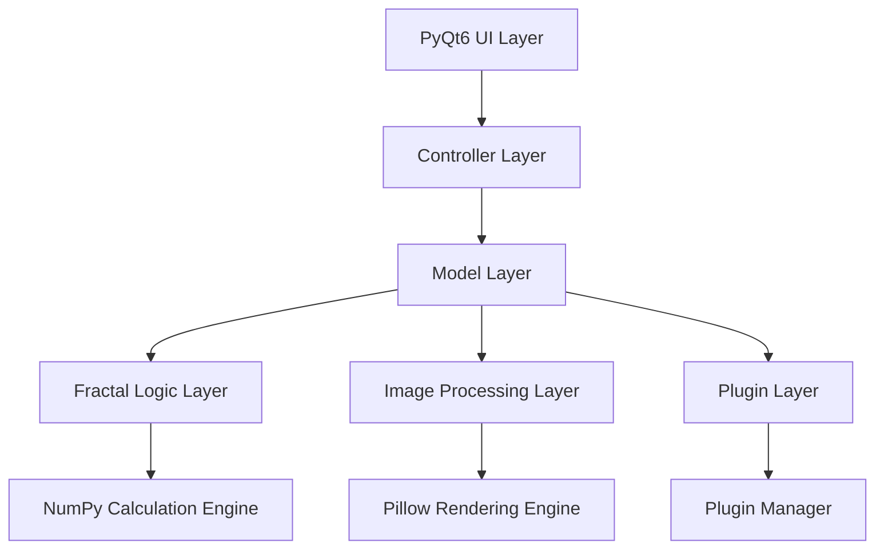

# 設計書

## 概要

Windowsデスクトップアプリケーションとしてのフラクタルエディタは、PythonとPyQt6を使用して実装されます。MVCアーキテクチャパターンを採用し、数学的に正確なフラクタル計算、リアルタイムプレビュー、高品質画像出力、拡張可能なプラグインシステムを提供します。NumPyによる高速数値計算とPillowによる画像処理を活用します。

- 初期実装では「マンデルブロ集合」「ジュリア集合」をプラグインとして実装し、他のアルゴリズムもプラグインとして追加可能な設計とする。
- パラメータ調整は数値入力欄＋マウススクロールで行い、スライダーは原則使用しない。パラメータのプリセット保存・読込機能を持つ。
- 色彩・視覚効果はグラデーションパック、グラデーションエディタ、RGBAサポート、背景グラデーション等をサポート。
- UIはドラッグで表示範囲移動、スクロールでズーム、パラメータ変更時は即時プレビュー更新。

## アーキテクチャ

### 全体アーキテクチャ



### レイヤー構成

1. **プレゼンテーション層 (PyQt6)**
   - MainWindow: メインアプリケーションウィンドウ (QMainWindow)
   - FractalWidget: フラクタル表示用カスタムウィジェット (QWidget)
   - ParameterPanel: パラメータ調整UI (QDockWidget)
     - 数値入力欄でパラメータを直接入力し、マウススクロールで値を変更可能
     - パラメータプリセットの保存・読込機能
   - ColorPaletteWidget: 色彩設定UI (QWidget)
     - グラデーションパックの選択、グラデーションエディタによる編集
     - RGBA形式や背景グラデーションの設定
   - MenuBar: メニューバーとツールバー (QMenuBar, QToolBar)
   - 操作:
     - ドラッグで表示範囲の移動
     - スクロールでズームイン/アウト
     - パラメータが変化した場合は即座にプレビューを更新

2. **コントローラー層 (MVC)**
   - MainController: アプリケーション全体の制御
   - FractalController: フラクタル固有の操作制御
   - UIController: ユーザーインタラクション処理

3. **モデル層**
   - FractalModel: フラクタル生成の統合管理
   - ImageModel: 画像処理と出力管理
   - SettingsModel: アプリケーション設定管理

4. **フラクタル計算層**
   - FractalGenerator: フラクタル計算の基底クラス
   - MandelbrotGenerator, JuliaGenerator: それぞれプラグインとして実装
   - ParallelCalculator: multiprocessingによる並列計算
   - CustomFormulaGenerator: ユーザー独自式によるフラクタル生成

5. **プラグイン層**
   - FractalPlugin: フラクタル生成プラグインの基底クラス
   - PluginManager: プラグインの管理・ロード・有効化
   - 初期実装ではマンデルブロ集合・ジュリア集合のプラグインを同梱。他アルゴリズムは後日追加可能。

## コンポーネントとインターフェース

（※既存のインターフェース定義は要件定義書の内容に合致しているため、主要な部分は維持しますが、パラメータ調整・色彩・プラグイン・カスタム式の補足をコメントで明記します）

### 主要インターフェース

```python
from abc import ABC, abstractmethod
import numpy as np
from dataclasses import dataclass
from typing import Dict, Any, Tuple, List
import time

# フラクタル生成の抽象基底クラス
class FractalGenerator(ABC):
    @property
    @abstractmethod
    def name(self) -> str:
        pass

    @property
    @abstractmethod
    def description(self) -> str:
        pass

    @abstractmethod
    def calculate(self, parameters: 'FractalParameters') -> 'FractalResult':
        pass

    @abstractmethod
    def get_parameter_definitions(self) -> List['ParameterDefinition']:
        pass

# フラクタル計算結果
@dataclass
class FractalResult:
    iteration_data: np.ndarray  # 2D array of iteration counts
    region: 'ComplexRegion'
    calculation_time: float

# フラクタルパラメータ
@dataclass
class FractalParameters:
    region: 'ComplexRegion'
    max_iterations: int
    image_size: Tuple[int, int]  # (width, height)
    custom_parameters: Dict[str, Any]
```

### プラグインインターフェース

```python
from abc import ABC, abstractmethod
from dataclasses import dataclass
from typing import Dict, Any, List

# プラグインメタデータ
@dataclass
class PluginMetadata:
    name: str
    version: str
    author: str
    description: str

# プラグイン基底クラス
class FractalPlugin(ABC):
    @property
    @abstractmethod
    def metadata(self) -> PluginMetadata:
        pass

    @abstractmethod
    def create_generator(self) -> FractalGenerator:
        pass

# プラグイン実装例
class CustomFractalPlugin(FractalPlugin):
    @property
    def metadata(self) -> PluginMetadata:
        return PluginMetadata(
            name="Custom Fractal",
            version="1.0",
            author="Developer",
            description="カスタムフラクタル生成器"
        )

    def create_generator(self) -> FractalGenerator:
        return CustomFractalGenerator()
```

### 色彩システム

```python
from abc import ABC, abstractmethod
from dataclasses import dataclass
from typing import List, Tuple
from enum import Enum

# 色補間モード
class InterpolationMode(Enum):
    LINEAR = "linear"
    CUBIC = "cubic"
    HSV = "hsv"

# カラーストップ
@dataclass
class ColorStop:
    position: float  # 0.0 - 1.0
    color: Tuple[int, int, int]  # RGB

# カラーパレット
@dataclass
class ColorPalette:
    name: str
    color_stops: List[ColorStop]
    interpolation_mode: InterpolationMode = InterpolationMode.LINEAR

# カラーマッピングインターフェース
class ColorMapper(ABC):
    @abstractmethod
    def map_iteration_to_color(self, iteration: int, max_iteration: int) -> Tuple[int, int, int]:
        pass

    @abstractmethod
    def set_palette(self, palette: ColorPalette) -> None:
        pass
```

## データモデル

### 複素数と数学的構造

```python
import math
from dataclasses import dataclass
from typing import Tuple

# 複素数クラス
@dataclass
class ComplexNumber:
    real: float
    imaginary: float

    @property
    def magnitude(self) -> float:
        return math.sqrt(self.real * self.real + self.imaginary * self.imaginary)

    def square(self) -> 'ComplexNumber':
        return ComplexNumber(
            real=self.real * self.real - self.imaginary * self.imaginary,
            imaginary=2 * self.real * self.imaginary
        )

    def __add__(self, other: 'ComplexNumber') -> 'ComplexNumber':
        return ComplexNumber(self.real + other.real, self.imaginary + other.imaginary)

# 複素平面領域
@dataclass
class ComplexRegion:
    top_left: ComplexNumber
    bottom_right: ComplexNumber

    @property
    def width(self) -> float:
        return self.bottom_right.real - self.top_left.real

    @property
    def height(self) -> float:
        return self.top_left.imaginary - self.bottom_right.imaginary

# パラメータ定義
@dataclass
class ParameterDefinition:
    name: str
    display_name: str
    parameter_type: str  # 'float', 'int', 'complex', 'bool'
    default_value: Any
    min_value: Any = None
    max_value: Any = None
    description: str = ""
```

### 設定とプロジェクト

```python
import os
from datetime import datetime
from dataclasses import dataclass, field
from typing import Tuple

# アプリケーション設定
@dataclass
class AppSettings:
    default_max_iterations: int = 1000
    default_image_size: Tuple[int, int] = (800, 600)
    default_color_palette: str = "Rainbow"
    enable_anti_aliasing: bool = True
    thread_count: int = field(default_factory=lambda: os.cpu_count() or 4)
    auto_save_interval: int = 300  # seconds
    recent_projects_count: int = 10

# フラクタルプロジェクト
@dataclass
class FractalProject:
    name: str
    fractal_type: str
    parameters: FractalParameters
    color_palette: ColorPalette
    last_modified: datetime = field(default_factory=datetime.now)
    file_path: str = ""

    def save_to_file(self, file_path: str) -> None:
        """プロジェクトをファイルに保存"""
        self.file_path = file_path
        self.last_modified = datetime.now()
        # JSON形式で保存する実装

    @classmethod
    def load_from_file(cls, file_path: str) -> 'FractalProject':
        """ファイルからプロジェクトを読み込み"""
        # JSON形式から読み込む実装
        pass
```

## エラーハンドリング

### エラー分類と処理戦略

1. **計算エラー**
   - 数値オーバーフロー: 適切な範囲制限と警告表示
   - 無限ループ: タイムアウト機能とキャンセレーション
   - メモリ不足: 段階的品質低下とガベージコレクション

2. **プラグインエラー**
   - ロード失敗: エラーログ記録と代替手段提示
   - 実行時例外: サンドボックス化とアプリケーション保護
   - バージョン不整合: 互換性チェックと警告

3. **UI/UXエラー**
   - 無効なパラメータ: リアルタイム検証とフィードバック
   - ファイルI/Oエラー: 詳細なエラーメッセージと復旧オプション

### カスタム式エディタシステム

```python
from abc import ABC, abstractmethod
from dataclasses import dataclass
from typing import Dict, Any, List, Callable
import ast
import operator
import math
import cmath

# 数式パーサーとエバリュエーター
class FormulaParser:
    """複素数式を解析・評価するクラス"""

    # 許可された演算子と関数
    ALLOWED_OPERATORS = {
        ast.Add: operator.add,
        ast.Sub: operator.sub,
        ast.Mult: operator.mul,
        ast.Div: operator.truediv,
        ast.Pow: operator.pow,
        ast.USub: operator.neg,
        ast.UAdd: operator.pos,
    }

    ALLOWED_FUNCTIONS = {
        'sin': cmath.sin,
        'cos': cmath.cos,
        'tan': cmath.tan,
        'exp': cmath.exp,
        'log': cmath.log,
        'sqrt': cmath.sqrt,
        'abs': abs,
        'conj': complex.conjugate,
    }

    def __init__(self, formula: str):
        self.formula = formula
        self.compiled_formula = None
        self._validate_and_compile()

    def _validate_and_compile(self) -> None:
        """数式の妥当性を検証し、コンパイルする"""
        try:
            tree = ast.parse(self.formula, mode='eval')
            self._validate_ast(tree)
            self.compiled_formula = compile(tree, '<formula>', 'eval')
        except (SyntaxError, ValueError) as e:
            raise FormulaValidationError(f"Invalid formula: {e}")

    def _validate_ast(self, node) -> None:
        """ASTノードの安全性を検証"""
        if isinstance(node, ast.Expression):
            self._validate_ast(node.body)
        elif isinstance(node, ast.BinOp):
            if type(node.op) not in self.ALLOWED_OPERATORS:
                raise ValueError(f"Operator {type(node.op).__name__} not allowed")
            self._validate_ast(node.left)
            self._validate_ast(node.right)
        elif isinstance(node, ast.UnaryOp):
            if type(node.op) not in self.ALLOWED_OPERATORS:
                raise ValueError(f"Operator {type(node.op).__name__} not allowed")
            self._validate_ast(node.operand)
        elif isinstance(node, ast.Call):
            if not isinstance(node.func, ast.Name) or node.func.id not in self.ALLOWED_FUNCTIONS:
                raise ValueError(f"Function not allowed")
            for arg in node.args:
                self._validate_ast(arg)
        elif isinstance(node, (ast.Constant, ast.Num)):
            pass  # 定数は許可
        elif isinstance(node, ast.Name):
            if node.id not in ['z', 'c', 'n', 'pi', 'e', 'i', 'j']:
                raise ValueError(f"Variable {node.id} not allowed")
        else:
            raise ValueError(f"AST node type {type(node).__name__} not allowed")

    def evaluate(self, z: complex, c: complex, n: int) -> complex:
        """数式を評価する"""
        if not self.compiled_formula:
            raise RuntimeError("Formula not compiled")

        context = {
            'z': z,
            'c': c,
            'n': n,
            'pi': math.pi,
            'e': math.e,
            'i': 1j,
            'j': 1j,
            **self.ALLOWED_FUNCTIONS
        }

        try:
            result = eval(self.compiled_formula, {"__builtins__": {}}, context)
            if isinstance(result, (int, float)):
                return complex(result)
            elif isinstance(result, complex):
                return result
            else:
                raise ValueError(f"Formula must return a number, got {type(result)}")
        except Exception as e:
            raise FormulaEvaluationError(f"Error evaluating formula: {e}")

# カスタム式フラクタル生成器
class CustomFormulaGenerator(FractalGenerator):
    """ユーザー定義式によるフラクタル生成器"""

    def __init__(self, formula: str, name: str = "Custom Formula"):
        self._name = name
        self.formula_parser = FormulaParser(formula)
        self.formula_text = formula

    @property
    def name(self) -> str:
        return self._name

    @property
    def description(self) -> str:
        return f"Custom fractal with formula: {self.formula_text}"

    def calculate(self, parameters: 'FractalParameters') -> 'FractalResult':
        """カスタム式でフラクタルを計算"""
        start_time = time.time()

        width, height = parameters.image_size
        iteration_data = np.zeros((height, width), dtype=int)

        # 複素平面の座標を計算
        x_min, x_max = parameters.region.top_left.real, parameters.region.bottom_right.real
        y_min, y_max = parameters.region.bottom_right.imaginary, parameters.region.top_left.imaginary

        x_coords = np.linspace(x_min, x_max, width)
        y_coords = np.linspace(y_min, y_max, height)

        for i, y in enumerate(y_coords):
            for j, x in enumerate(x_coords):
                c = complex(x, y)
                z = complex(0, 0)  # 初期値

                for n in range(parameters.max_iterations):
                    try:
                        z = self.formula_parser.evaluate(z, c, n)

                        # 発散判定
                        if abs(z) > 2.0:
                            iteration_data[i, j] = n
                            break
                    except (OverflowError, ZeroDivisionError):
                        iteration_data[i, j] = n
                        break
                else:
                    iteration_data[i, j] = parameters.max_iterations

        calculation_time = time.time() - start_time

        return FractalResult(
            iteration_data=iteration_data,
            region=parameters.region,
            calculation_time=calculation_time
        )

    def get_parameter_definitions(self) -> List['ParameterDefinition']:
        return [
            ParameterDefinition(
                name="formula",
                display_name="数式",
                parameter_type="formula",
                default_value=self.formula_text,
                description="フラクタル生成式 (例: z**2 + c)"
            )
        ]

# 式エディタUI用のデータクラス
@dataclass
class FormulaTemplate:
    name: str
    formula: str
    description: str
    example_params: Dict[str, Any] = None

# プリセット式テンプレート
FORMULA_TEMPLATES = [
    FormulaTemplate(
        name="マンデルブロ集合",
        formula="z**2 + c",
        description="古典的なマンデルブロ集合"
    ),
    FormulaTemplate(
        name="ジュリア集合",
        formula="z**2 + c",
        description="ジュリア集合（cは固定値）"
    ),
    FormulaTemplate(
        name="バーニングシップ",
        formula="(abs(z.real) + abs(z.imag)*1j)**2 + c",
        description="バーニングシップフラクタル"
    ),
    FormulaTemplate(
        name="カスタム例1",
        formula="c / (2*z**3 - 2) + 1",
        description="ユーザー提供の例"
    ),
    FormulaTemplate(
        name="三次式",
        formula="z**3 + c",
        description="三次のフラクタル"
    ),
    FormulaTemplate(
        name="指数関数",
        formula="exp(z) + c",
        description="指数関数ベースのフラクタル"
    ),
    FormulaTemplate(
        name="三角関数",
        formula="sin(z) + c",
        description="正弦関数ベースのフラクタル"
    )
]

# カスタム例外クラス
class FormulaValidationError(Exception):
    """数式検証エラー"""
    pass

class FormulaEvaluationError(Exception):
    """数式評価エラー"""
    pass
```

### エラーハンドリング実装

```python
# カスタム例外クラス
class FractalCalculationException(Exception):
    """フラクタル計算エラー"""
    def __init__(self, message: str, parameters: 'FractalParameters', stage: str):
        super().__init__(message)
        self.parameters = parameters
        self.stage = stage

# エラー処理サービス
class ErrorHandlingService:
    @staticmethod
    def handle_calculation_error(ex: FractalCalculationException) -> None:
        """計算エラーを処理"""
        # ログ記録
        import logging
        logging.error(f"Fractal calculation failed at stage: {ex.stage}, Error: {ex}")

        # ユーザー通知（PyQt6のメッセージボックス）
        from PyQt6.QtWidgets import QMessageBox
        msg = QMessageBox()
        msg.setIcon(QMessageBox.Icon.Warning)
        msg.setWindowTitle("計算エラー")
        msg.setText(f"フラクタル計算でエラーが発生しました: {ex}")
        msg.exec()

    @staticmethod
    def handle_formula_error(ex: Union[FormulaValidationError, FormulaEvaluationError]) -> None:
        """数式エラーを処理"""
        from PyQt6.QtWidgets import QMessageBox
        msg = QMessageBox()
        msg.setIcon(QMessageBox.Icon.Critical)
        msg.setWindowTitle("数式エラー")
        msg.setText(f"数式にエラーがあります: {ex}")
        msg.setDetailedText("使用可能な変数: z, c, n\n使用可能な関数: sin, cos, tan, exp, log, sqrt, abs, conj")
        msg.exec()
```

## テスト戦略

### テストレベル

1. **単体テスト**
   - フラクタル計算アルゴリズムの数学的正確性
   - 色彩マッピング機能の品質
   - プラグインインターフェースの動作

2. **統合テスト**
   - UI-ViewModel間のデータバインディング
   - 並列計算エンジンの協調動作
   - ファイルI/O操作の整合性

3. **パフォーマンステスト**
   - 大規模フラクタル計算の処理時間
   - メモリ使用量の最適化検証
   - UI応答性の測定

4. **ユーザビリティテスト**
   - 直感的なパラメータ調整
   - エラー状況での回復性
   - プラグイン管理の使いやすさ

### テスト実装例

```python
import unittest
import numpy as np
from fractal_generators import MandelbrotGenerator
from data_models import FractalParameters, ComplexRegion, ComplexNumber

class TestMandelbrotGenerator(unittest.TestCase):
    def test_calculate_standard_parameters_returns_expected_result(self):
        # Arrange
        generator = MandelbrotGenerator()
        parameters = FractalParameters(
            region=ComplexRegion(
                top_left=ComplexNumber(-2.0, 1.0),
                bottom_right=ComplexNumber(1.0, -1.0)
            ),
            max_iterations=100,
            image_size=(100, 100),
            custom_parameters={}
        )

        # Act
        result = generator.calculate(parameters)

        # Assert
        self.assertIsNotNone(result)
        self.assertEqual(result.iteration_data.shape, (100, 100))
        self.assertGreater(result.calculation_time, 0)

class TestCustomFormulaGenerator(unittest.TestCase):
    def test_custom_formula_evaluation(self):
        # Arrange
        formula = "c / (2*z**3 - 2) + 1"
        generator = CustomFormulaGenerator(formula, "Test Formula")

        # Act & Assert
        self.assertEqual(generator.name, "Test Formula")
        self.assertIn("c / (2*z**3 - 2) + 1", generator.description)

    def test_formula_validation(self):
        # Test valid formula
        valid_formula = "z**2 + c"
        parser = FormulaParser(valid_formula)
        self.assertIsNotNone(parser.compiled_formula)

        # Test invalid formula
        with self.assertRaises(FormulaValidationError):
            FormulaParser("import os; os.system('rm -rf /')")  # 危険なコード
```

### 継続的品質保証

- **自動テスト**: CI/CDパイプラインでの自動実行
- **コードカバレッジ**: 最低80%のカバレッジ目標
- **静的解析**: SonarQubeによるコード品質チェック
- **パフォーマンス監視**: ベンチマークテストの定期実行
